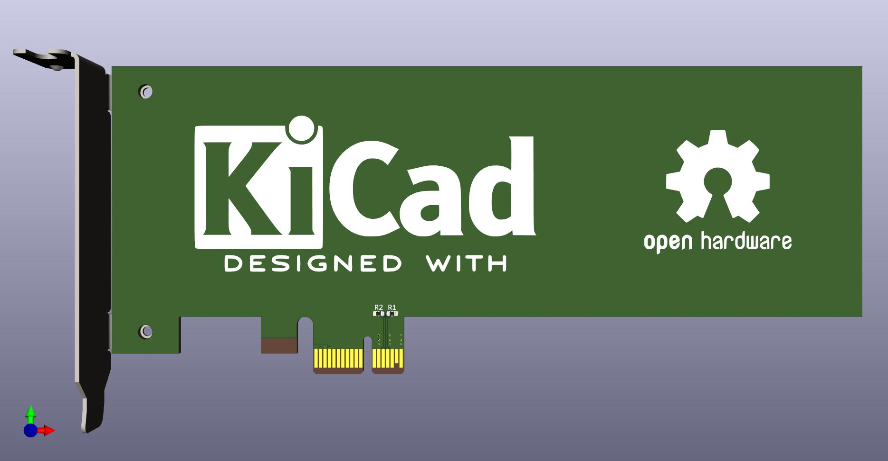

# PCIexpress-KiCad
PCI Express™ libraries and templates for KiCad
Made using guidelines from PCI Express™ Card Electromechanical Specification Rev. 1.2 and PCI Express™ M.2 Specification Revision 1.0

Updated for KiCad 9.0.1

### Contents
**Templates:**
* M.2 A Key 22/30mm width, 30/42/60/80/110mm length
* M.2 B Key 22/30mm width, 30/42/60/80/110mm length
* M.2 M Key 22/30mm width, 30/42/60/80/110mm length
* M.2 E Key 22/30mm width, 30/42/60/80/110mm length
* M.2 B+M Key 22/30mm width, 30/42/60/80/110mm length
* x1 cards: full size, half length, low profile
* x2 cards: full size, half length, low profile
* x4 cards: full size, half length, low profile
* x8 cards: full size, half length, low profile
* x16 cards: full size, half length, low profile

**Symbols:**
* A Key M.2
* B Key M.2
* C Key M.2
* D Key M.2
* E Key M.2
* F Key M.2
* G Key M.2
* H Key M.2
* J Key M.2
* K Key M.2
* L Key M.2
* M Key M.2
* A+E Key M.2
* B+M Key M.2
* x1
* x2
* x4
* x8
* x16
* Bracket

**Footprints:**
* A Key M.2 with multiple card outlines
* B Key M.2 with multiple card outlines
* C Key M.2 with multiple card outlines
* D Key M.2 with multiple card outlines
* E Key M.2 with multiple card outlines
* F Key M.2 with multiple card outlines
* G Key M.2 with multiple card outlines
* H Key M.2 with multiple card outlines
* J Key M.2 with multiple card outlines
* K Key M.2 with multiple card outlines
* L Key M.2 with multiple card outlines
* M Key M.2 with multiple card outlines
* A+E Key M.2 with multiple card outlines
* B+M Key M.2 with multiple card outlines
* x1 with multiple card outlines
* x2 with multiple card outlines
* x4 with multiple card outlines
* x8 with multiple card outlines
* x16 with multiple card outlines
* Full height bracket (with 3D model)
* Low profile bracket (with 3D model)
* Low profile to full height adapter bracker (with 3D model)

**Notes:**
* Transmit and Recieve pairs on M.2 Symbols are from the perspective of module not the host.
* Transmit and Recieve pairs on PCIe symbols are from the perspective of the host not the module. This will be changed in the future.
* Triple check the pinout on your specific M.2 socket to ensure correct wiring.

### License
This documentation describes Open Hardware and is licensed under the CERN OHL v.1.2.

You may redistribute and modify this documentation under the terms of the CERN OHL v.1.2. (http://ohwr.org/cernohl). This documentation is distributed WITHOUT ANY EXPRESS OR IMPLIED WARRANTY, INCLUDING OF MERCHANTABILITY, SATISFACTORY QUALITY AND FITNESS FOR A PARTICULAR PURPOSE. Please see the CERN OHL v.1.2 for applicable conditions.
